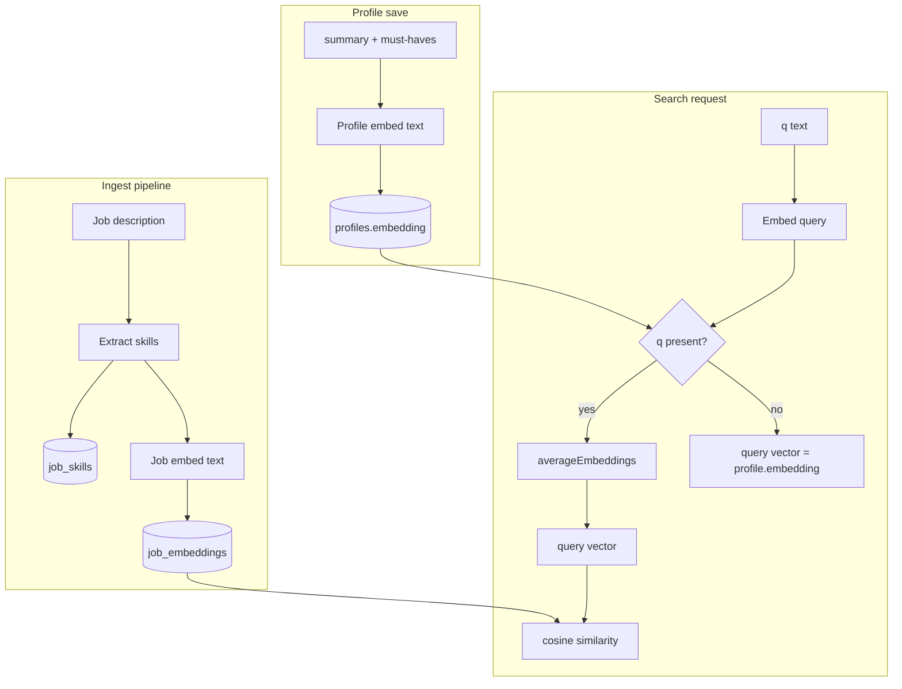
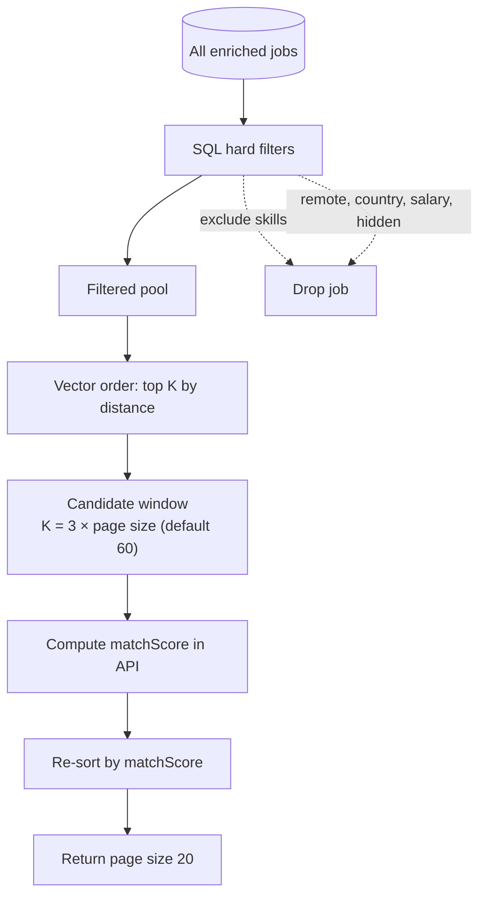
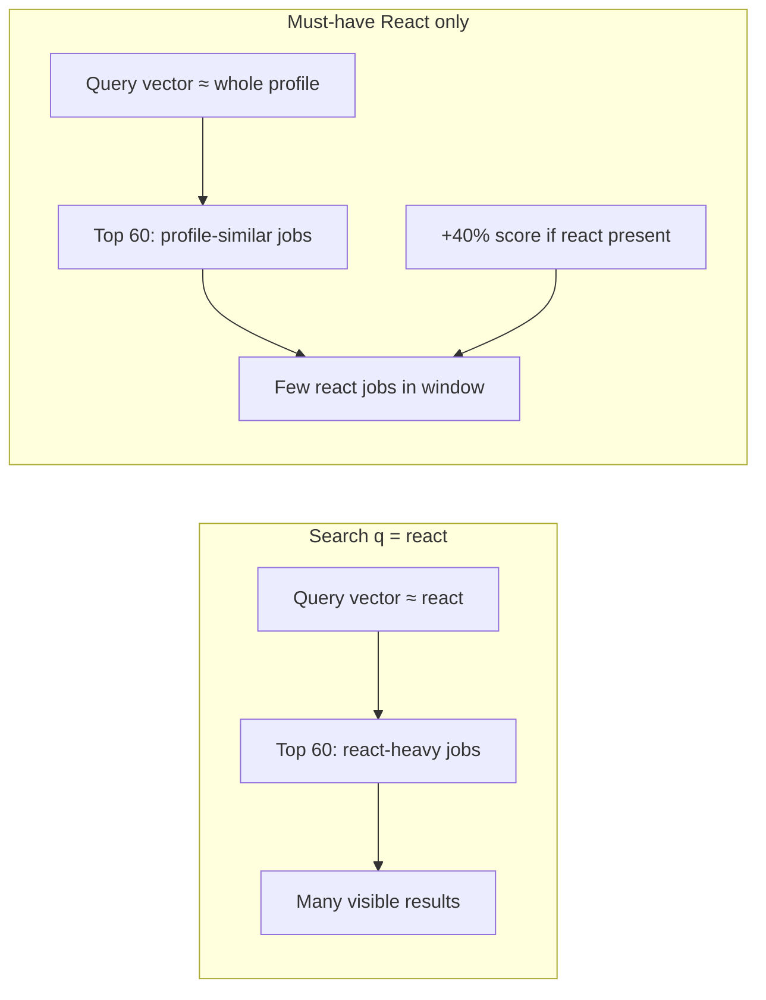

# Search, embeddings, and scoring

How JobFinder turns job text into vectors, ranks results, and why **Search `q`**
and **Must-have skills** behave differently today. Read this before changing
filter semantics (see the refactor issue for Must-have → hard filter).

Related: `ARCHITECTURE.md` §8, `CONTEXT.md`, ADR 0005 (ingest vs search terms).

---

## 1. What gets embedded?

JobFinder uses **Ollama** with `nomic-embed-text` (768 dimensions, pgvector
HNSW index). Two embedding flows exist:

| Object      | When                                    | Input text                                                          | Stored in            |
| ----------- | --------------------------------------- | ------------------------------------------------------------------- | -------------------- |
| **Job**     | After ingest extract stage              | `title + company + skill names + descriptionText` (document prefix) | `job_embeddings`     |
| **Profile** | After every profile save (async worker) | `summary · mustHaveSkill1 · mustHaveSkill2 …`                       | `profiles.embedding` |

**Search `q`** is embedded **on the fly** per request (query prefix). It is **not**
stored. If `q` is present, its vector is **averaged** with the profile vector for
that request only.



---

## 2. Hybrid search pipeline (today)

Search is **not** “embed everything and return the closest jobs”. It is a
**two-stage funnel**:



### Stage A — SQL filters (deterministic)

Applied to **every** job in the pool. Survivors only.

| Filter             | Source  | Effect                                                      |
| ------------------ | ------- | ----------------------------------------------------------- |
| **Exclude skills** | Profile | Job must **not** have any listed skill in `job_skills`      |
| Remote type        | Profile | Empty = any                                                 |
| Country            | Profile | Empty = any                                                 |
| Min salary         | Profile | Job `salary_max` must meet floor (or unknown salary passes) |
| Hidden             | Request | Hidden jobs omitted unless `includeHidden`                  |
| Max age            | Request | Optional freshness window                                   |

**Must-have skills are not applied here today** — they only enter stage C.

### Stage B — Vector retrieval (approximate nearest neighbours)

Among survivors, Postgres orders by **cosine distance** between:

- `job_embeddings.embedding`
- **Query vector** = profile embedding, or `average(profile, embed(q))`

Only the **top K** rows are kept (`K = 3 × limit`, default **60**). Everything
else is invisible to the API layer, even if `total` counts the full filtered pool.

This is the main reason **Must-have React** and **`q=react`** show different
lists: they use **different query vectors**, so they pick **different top-60
windows**.

### Stage C — Scoring and re-rank (in application code)

For each candidate in the window:

```
similarity       = 1 - (job_embedding <=> query_embedding)   -- 0..1
mustHaveCoverage = matching_must_haves / count(must_have_skills) -- 0..1
matchScore       = round(100 × (0.6 × similarity + 0.4 × mustHaveCoverage))
```

Jobs are **re-sorted by `matchScore`** before pagination cursors are applied.
Must-haves **boost** score; they do **not** remove jobs without the skill.

Skill chips on cards (`must_have` / `excluded` / `neutral`) are computed from
profile vs `job_skills` for display only (except exclude, which already filtered).

---

## 3. Why `q=react` ≠ Must-have React



|                     | **`q=react`**                 | **Must-have React**                         |
| ------------------- | ----------------------------- | ------------------------------------------- |
| Query vector        | Strongly “react”              | Full profile (summary + all must-haves)     |
| Who enters top 60?  | Semantically react-like jobs  | Jobs similar to overall profile             |
| Must-have filter?   | No                            | No                                          |
| React in job_skills | Often many (visible in chips) | Only affects score if job already in window |
| Typical UX          | Many results ~score 40        | One/few results; rest unrelated to react    |

After a profile save, **`profiles.embedding` updates asynchronously** (BullMQ
`profile-embed` worker). Until that finishes, search still uses the **old**
profile vector.

---

## 4. `total` vs what you see

- **`total`**: count of all jobs passing **SQL filters** (excludes, remote, …).
- **`items`**: up to 20 jobs from the **top-60 vector window**, re-ranked.

You can have `total=200` but only see jobs that won the vector lottery. Load
more paginates **within the same 60 candidates**, not the full 200.

---

## 5. Models and prefixes

| Step                | Model              | Notes                               |
| ------------------- | ------------------ | ----------------------------------- |
| Skill extract       | `qwen2.5:3b` (env) | JSON list of `{ name, confidence }` |
| Job + profile embed | `nomic-embed-text` | 768-dim vectors                     |
| Query embed         | same               | `search_query:` prefix for `q`      |

Job embed text includes extracted **canonical skill names**, not raw
description phrases. If extract missed “React”, vector search may still find
semantic similarity in description text (embedded in job text), but
**must-have coverage** only counts `job_skills` rows.

---

## 6. Intended product direction (refactor)

Current design (Phase 2): **Exclude filters, Must-have ranks**. That matches
the code but **not** the Tag bar UX (Skills next to Exclude).

Planned refactor ([#56](https://github.com/ktauchert/jobfinder-companion/issues/56)):

- **Must-have → hard filter** when the list is non-empty (semantics TBD: match
  **any** vs **all** must-haves).
- Run vector top-K **after** skill filter, or raise K so filtered pools are not
  truncated arbitrarily.
- Integration tests: same fixture DB, `q=react` vs Must-have React → documented
  expectations.
- Update `CONTEXT.md`, ADR, and Tag bar labels.

Until that lands, treat **Search `q`** as “semantic focus” and **Must-have** as
“score boost inside a profile-shaped vector window” — not as a skill filter.
